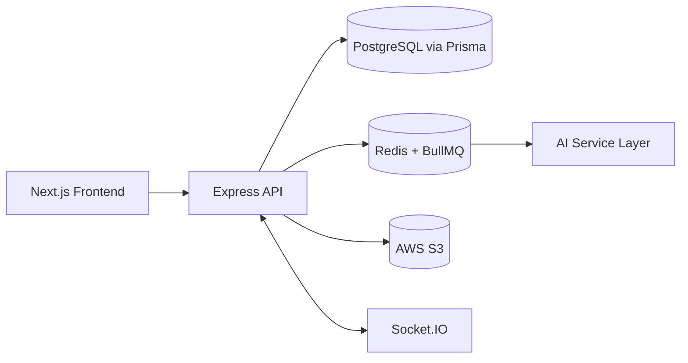

# HireMind AI

**Intelligence Behind Every Hire.**

An AI-powered Candidate Intelligence & Recruitment Platform. This README covers **Phase 1**: architecture, project setup, design system, and database schema. Later phases (auth flows, matching engine, AI interview, etc.) extend this same codebase — nothing here gets thrown away.

> Stack note: the whole codebase is **plain JavaScript** (no TypeScript), per project requirements.

## Architecture



## Tech Stack

| Layer | Choice |
|---|---|
| Frontend | Next.js 14 (App Router), React, Tailwind CSS, Framer Motion, TanStack Query |
| Backend | Node.js, Express, JavaScript |
| Database | PostgreSQL + Prisma ORM |
| Auth | JWT + bcrypt, role-based access control |
| Queue | Redis + BullMQ (wired in Phase 5) |
| Realtime | Socket.IO |
| Storage | AWS S3 (wired in Phase 4) |
| AI | Dedicated AI service layer with Zod-validated structured output (Phase 6+) |

## Folder Structure

```
hiremind-ai/
  frontend/
    app/                # Next.js App Router pages
    components/
      ui/                # Button, Card, Badge, ScoreRing (design system)
      layout/            # Navbar, Footer, ThemeProvider, Logo
      landing/            # Landing page sections
    lib/                 # cn() utility, API client (added Phase 2)
  backend/
    src/
      controllers/        # Auth controller (Phase 1)
      services/           # Business logic (auth.service.js)
      routes/              # Express routers
      middleware/          # auth, validation, centralized error handler
      validators/          # Zod schemas
      workers/             # BullMQ workers (Phase 5+)
      queues/              # BullMQ queue definitions (Phase 5+)
      config/              # env.js, prisma.js
    prisma/
      schema.prisma        # Database schema
      seed.js               # DEMO DATA only
  docker-compose.yml
```

## Environment Variables

Copy the example files before running anything:

```bash
cp backend/.env.example backend/.env
cp frontend/.env.example frontend/.env
```

| Variable | Where | Purpose |
|---|---|---|
| `DATABASE_URL` | backend | PostgreSQL connection string |
| `JWT_SECRET` | backend | Signs auth tokens — use a long random value |
| `REDIS_URL` | backend | Redis connection (Phase 5) |
| `AWS_*` | backend | S3 resume storage (Phase 4) |
| `OPENAI_API_KEY` | backend | AI service layer (Phase 6) |
| `NEXT_PUBLIC_API_URL` | frontend | Base URL the frontend calls |

Never commit real secrets — only `.env.example` is checked in.

## Database Setup

```bash
cd backend
npm install
npx prisma migrate dev --name init
npm run seed        # optional — creates DEMO DATA only
```

## Running Locally (without Docker)

```bash
# Terminal 1 — backend
cd backend
npm install
npm run dev          # http://localhost:5000

# Terminal 2 — frontend
cd frontend
npm install
npm run dev           # http://localhost:3000
```

## Running with Docker

```bash
docker compose up --build
```

This starts PostgreSQL, Redis, the backend API, and the frontend. Run migrations once the `postgres` container is healthy:

```bash
docker compose exec backend npx prisma migrate dev --name init
```

## What's Working After Phase 1

- Premium, responsive landing page (dark/light mode, glassmorphism, animated score rings, animated skill bars)
- Reusable design system: `Button`, `Card`, `Badge`, `ScoreRing`
- PostgreSQL schema via Prisma: `User`, `CandidateProfile`, `RecruiterProfile`, `Company`, `Job`, `JobSkill`, plus placeholder `Resume`/`Application` models
- Real authentication foundation: `POST /api/auth/register`, `POST /api/auth/login`, `GET /api/auth/me` — bcrypt password hashing, JWT issuance, Zod validation, centralized error handling
- Role-based access control middleware (`authenticate`, `authorize`) ready for Phase 3+ routes
- Socket.IO server initialized (events wired in Phase 13)
- Docker Compose environment (Postgres, Redis, backend, frontend)
- DEMO DATA seed script, clearly separated from real user data

## Testing Checklist (Phase 1)

- [ ] `GET /api/health` returns `{ success: true }`
- [ ] `POST /api/auth/register` with a valid `CANDIDATE` payload creates a user + `CandidateProfile`
- [ ] `POST /api/auth/register` with a valid `RECRUITER` payload creates a user + `RecruiterProfile`
- [ ] Registering the same email twice returns `409 EMAIL_TAKEN`
- [ ] `POST /api/auth/login` with correct credentials returns a JWT
- [ ] `POST /api/auth/login` with wrong password returns `401 INVALID_CREDENTIALS`
- [ ] `GET /api/auth/me` with a valid Bearer token returns the current user
- [ ] `GET /api/auth/me` with no token returns `401`
- [ ] Landing page loads at `/`, dark/light toggle works, layout is usable on mobile width

## Phase 2 — Authentication UI + RBAC

### Backend additions
- `POST /api/auth/forgot-password` — always returns the same generic message whether or not the email exists (no user enumeration)
- `POST /api/auth/reset-password` — validates a hashed, time-limited (1 hour) reset token
- `src/services/email.service.js` — a real notification abstraction. No provider is configured yet, so it logs a clearly-labeled **DEV FALLBACK** instead of pretending to deliver an email
- `src/middleware/rateLimiters.js` — stricter rate limiting on all auth endpoints (20 requests / 15 min)
- `User.resetTokenHash` / `resetTokenExpiry` added to the schema — run `npx prisma migrate dev --name add_password_reset`

### Frontend additions
- `context/AuthContext.js` — session state, login/register/logout, rehydrates from a stored JWT on load
- `lib/api.js` — typed fetch wrapper that surfaces real backend error messages
- Pages: `/login`, `/register` (role selection + live password-strength meter), `/forgot-password`, `/reset-password`
- `components/auth/ProtectedRoute.js` — client-side route guard; redirects unauthenticated users to `/login` and wrong-role users away. **Note:** this is a client-side check for development speed — Phase 15 (security hardening) should move this to cookie-based Next.js middleware so protection doesn't depend on client JS running correctly.
- Role-aware Navbar (Sign In/Get Started vs. Dashboard/Sign out)
- Minimal, real role-protected dashboards at `/candidate/dashboard` and `/recruiter/dashboard` (fetch the live user via `/api/auth/me`) — full dashboards arrive in Phase 9 and Phase 12

### Testing Checklist (Phase 2)
- [ ] Register as Candidate → redirected to `/candidate/dashboard`, name shown is real
- [ ] Register as Recruiter → redirected to `/recruiter/dashboard`
- [ ] Registering a duplicate email shows the inline "already exists" error, not a crash
- [ ] Password strength meter reacts live while typing
- [ ] Login with wrong password shows an inline error, not a redirect
- [ ] Visiting `/candidate/dashboard` while logged out redirects to `/login`
- [ ] Visiting `/recruiter/dashboard` while logged in as a candidate redirects away
- [ ] Forgot Password always shows the same success message, and the backend console prints the `[DEV FALLBACK]` email log
- [ ] Reset Password with a valid token updates the password and redirects to `/login`
- [ ] Reset Password with an expired/invalid token shows `RESET_TOKEN_INVALID` / `RESET_TOKEN_EXPIRED`
- [ ] Reloading the page while logged in keeps the session (JWT rehydration)
- [ ] Sign out clears the session and redirects to `/login`

## Phase 3 — Recruiter Company + Job Management

### Backend additions
- `PUT /api/company/me` / `GET /api/company/me` — recruiter's company profile. First save creates the company and links it to the recruiter's profile; every save after that updates the same record
- Full Job CRUD, all recruiter-only and ownership-checked (a recruiter can only ever touch jobs belonging to their own company):
  - `POST /api/jobs` — create (draft by default, or `isPublished: true`)
  - `GET /api/jobs/mine` — the signed-in recruiter's own jobs (`?status=draft|published`, `?search=`)
  - `GET /api/jobs` — public, published-only listing (`?search=`, `?location=`) — the foundation Job Discovery/Matching (Phase 7) will build on
  - `GET /api/jobs/:id` — single job with its skills and company
  - `PUT /api/jobs/:id` — update; replaces the job's skill set transactionally so the wizard can always send the full current list
  - `PATCH /api/jobs/:id/publish` — toggle published/draft
  - `DELETE /api/jobs/:id` — delete (cascades to its `JobSkill` rows)
- No new migration needed — `Company`, `Job`, and `JobSkill` were already in the Phase 1 schema

### Frontend additions
- `components/dashboard/DashboardShell.js` + `Sidebar.js` + `Topbar.js` — the shared dashboard layout (sidebar with real vs. "Soon" links, mobile slide-over, theme toggle, sign out). Both Candidate and Recruiter dashboards now use this same shell
- `/recruiter/company` — company profile form
- `/recruiter/jobs` — job list as cards: status badge, required-skill chips, Edit/Publish-Toggle/Delete (with a confirm modal), empty state
- `/recruiter/jobs/new` and `/recruiter/jobs/[id]/edit` — a 7-step `JobWizard` (Basic Info → Description → Required Skills → Preferred Skills → Experience & Salary → Assessment placeholder → Review & Publish), built with React Hook Form + Zod, per-step validation, a tag-style `SkillInput`, animated step transitions, and a full review screen before "Save as Draft" or "Publish Job"
- `/recruiter/dashboard` — revamped with the new shell, real stats (Active Jobs / Drafts / Total Jobs) and a recent-jobs list, all pulled live from the API; nudges the recruiter to set up their company if they haven't yet
- `components/ui/Select.js`, `Textarea.js` — new reusable form primitives

### Testing Checklist (Phase 3)
- [ ] As a recruiter with no company yet, `/recruiter/dashboard` shows the "set up your company" prompt
- [ ] Save a company profile at `/recruiter/company` → reloading the page shows the saved values
- [ ] Try creating a job before setting up a company → get a clear `NO_COMPANY` error, not a crash
- [ ] Create a job through all 7 wizard steps → "Next" blocks on invalid fields for that step only
- [ ] Save as Draft → job appears in `/recruiter/jobs` with a Draft badge
- [ ] Toggle Publish on a job → badge flips to Published
- [ ] Edit a job → wizard opens pre-filled with its current values, including skills
- [ ] Delete a job → confirm modal appears; confirming removes it from the list
- [ ] `/recruiter/dashboard` stats (Active/Drafts/Total) update after creating/publishing/deleting jobs
- [ ] Logging in as a second recruiter (different company) cannot see or edit the first recruiter's jobs

## Phase 4 — Candidate Profile + Resume Upload + Cloudinary

> **Storage note:** this phase originally used AWS S3, per the initial spec. Per project requirements, storage was switched to **Cloudinary** before Phase 5 — the section below reflects the final Cloudinary-based version.

### Backend additions
- `Resume` model expanded to real fields (`fileName`, `storageKey`, `fileUrl`, `storedLocally`, `mimeType`, `sizeBytes`) and properly related to `User`
- `src/services/storage.service.js` — a real storage abstraction. If `CLOUDINARY_CLOUD_NAME` / `CLOUDINARY_API_KEY` / `CLOUDINARY_API_SECRET` are set, files upload to real Cloudinary (as `raw` resources, since resumes are PDFs). If not, it honestly logs a **DEV FALLBACK** and saves to `backend/uploads/` (served locally at `/uploads/...`) — never pretends local disk is Cloudinary
- `src/middleware/upload.middleware.js` — Multer, in-memory buffering, PDF-only `fileFilter`, 5MB limit, errors normalized to the standard `{ success:false, errorCode }` shape
- `POST /api/resumes/upload`, `GET /api/resumes/mine`, `GET /api/resumes/latest`, `GET /api/resumes/:id` (candidate-only, ownership-checked)
- `GET /api/candidates/me`, `PUT /api/candidates/me` — candidate profile (fullName, headline, location, phone)

### Frontend additions
- `/candidate/profile` — profile edit form
- `/candidate/resume` — real drag & drop uploader (`components/candidate/ResumeDropzone.js`) with client-side PDF/size validation and a **real** upload-progress bar driven by actual XHR upload events (not a fake timer), upload history list
- `/candidate/dashboard` — real profile/resume completion nudges pulled from the API

## Phase 5 — Redis + BullMQ + Resume Worker

### Backend additions
- **Schema change (requires a migration):** `Resume` gained `status` transitions (`UPLOADED → QUEUED → PROCESSING → COMPLETED | FAILED`), plus `extractedText`, `failureReason`, `processedAt`. Run: `npx prisma migrate dev --name add_resume_processing_fields`
- `src/config/redis.js` — one shared `ioredis` connection (with the settings BullMQ needs against hosted Redis) used by both the queue and the worker
- `src/queues/resumeQueue.js` — the `resume-processing` BullMQ queue
- `src/workers/resume.worker.js` — a **separate process**. On Render this deploys as its own "Background Worker" service (not part of the web service). It downloads the uploaded PDF (from Cloudinary or local dev storage), extracts its real text with `pdf-parse`, and writes that text + a `COMPLETED`/`FAILED` status back to the `Resume` row. This is real work — the extracted text is exactly what Phase 6's AI parser will read from, instead of re-parsing the PDF itself
- `resume.service.js` now enqueues a job right after upload; if Redis is unreachable, the resume is honestly marked `FAILED` with a real reason rather than silently appearing to succeed
- New dependencies: `bullmq`, `ioredis`, `pdf-parse`, `cloudinary` (added), `@aws-sdk/client-s3` removed — run `npm install` in `backend/`
- `docker-compose.yml` gained a `worker` service (same image as `backend`, runs `npm run worker:start`) so local dev mirrors the two-service Render layout
- New scripts: `npm run worker` (dev, auto-restart) / `npm run worker:start` (production) in `backend/package.json`

### Frontend additions
- `components/candidate/ResumeProcessingStatus.js` — polls `GET /api/resumes/:id` every 2s and renders the **actual** pipeline stage (Uploaded → Queued → Processing → Completed, or Failed with the real reason) with a live-updating stepper. Once `COMPLETED`, shows a preview of the real extracted text as proof the pipeline worked — full skill extraction is still Phase 6
- `/candidate/resume` now shows this live status under the uploader

### ⚠️ Important: you must run the worker as a separate process
The API server does **not** process resumes by itself anymore — uploads will sit at `QUEUED` forever unless the worker is also running:
```bash
# Terminal 3, in addition to backend (npm run dev) and frontend (npm run dev)
cd backend
npm run worker
```
With Docker Compose, `docker compose up --build` now starts it automatically as the `worker` service.

### Testing Checklist (Phase 5)
- [ ] Run the migration: `cd backend && npx prisma migrate dev --name add_resume_processing_fields`
- [ ] Start the worker in its own terminal (`npm run worker`) — you should see `HireMind AI resume worker started...`
- [ ] Upload a resume → status stepper moves Uploaded → Queued → Processing → Completed in real time (no manual refresh needed)
- [ ] Worker terminal prints `[resume.worker] Resume <id> processed — extracted N characters from M page(s)`
- [ ] Once Completed, the "Extracted text preview" on `/candidate/resume` shows real text from your actual PDF
- [ ] Stop the worker, then upload a resume → it stays stuck at `Queued` (proves processing genuinely depends on the worker, nothing is faked client-side)
- [ ] Upload a PDF that's just a scanned image with no real text layer → job fails with a clear reason, resume shows `Failed`, not a silent success
- [ ] Stop Redis (`docker stop hiremind-redis`) and upload → resume is marked `FAILED` with "Could not queue for background processing", not a crash

## Deployment (Render + Vercel + Cloudinary + Upstash)

This project is designed to deploy as **4 pieces**, all with generous free tiers:

| Piece | Where | Notes |
|---|---|---|
| Frontend (Next.js) | **Vercel** | Root directory: `frontend/`. Set `NEXT_PUBLIC_API_URL` to your deployed backend's `/api` URL |
| Backend API | **Render** (Web Service) | Root directory: `backend/`. Build: `npm install && npx prisma generate`. Start: `npm start` |
| Resume Worker | **Render** (Background Worker) | Same repo/root as the API. Build: `npm install && npx prisma generate`. Start: `npm run worker:start`. **This is a separate Render service from the API** — Render's "Background Worker" type, not a web service |
| Database | **Render Postgres** (or Neon/Supabase) | Add `?sslmode=require` to `DATABASE_URL` if your provider requires TLS |
| Redis | **Upstash** (recommended) | Free tier, TLS by default. Use the `rediss://` URL it gives you as `REDIS_URL` — the same URL goes to *both* the Render API service and the Render worker service |
| File storage | **Cloudinary** | Free tier. Set `CLOUDINARY_CLOUD_NAME`, `CLOUDINARY_API_KEY`, `CLOUDINARY_API_SECRET` on *both* Render services |

Environment variables to set identically on **both** the Render web service and the Render worker service: `DATABASE_URL`, `REDIS_URL`, `CLOUDINARY_*`, `JWT_SECRET`. `FRONTEND_URL`/`BACKEND_URL` only need to be correct on the web service (CORS + email links).

**Why Cloudinary is required in production, not optional:** the local-disk DEV FALLBACK only works because your API and worker share one filesystem on your laptop. On Render, the web service and worker service are separate containers with separate disks — a resume saved to the web service's local disk would be invisible to the worker. Configure Cloudinary before deploying, or resume processing will fail with a download error in production.

## Phase 6 — AI Resume Parsing + Resume Intelligence

### Backend additions
- **Schema change (part of the same migration as Phase 5 — see below):** `Resume` gained `skills`, `education`, `experience`, `projects`, `certifications` (all `Json`), `resumeScore`, `scoreBreakdown` (`Json`), `strengths`/`weaknesses`/`recommendations` (`Json`), and `aiProcessedAt`. Status now has a real `ANALYZING` stage between `PROCESSING` and `COMPLETED`
- `src/ai/aiClient.js` — the one place every AI call in the app goes through (OpenAI, JSON mode). **If `OPENAI_API_KEY` isn't set, it throws immediately rather than returning fake data** — there is no "dev fallback" for AI output, since a fallback that looks like real intelligence is exactly the fake-AI-response problem this project must avoid
- `src/ai/schemas/resumeParse.schema.js` + `src/ai/resumeParser.js` — the AI extracts structured facts (skills, education, experience, projects, certifications) from the resume text; its raw output is validated against a strict Zod schema, retried once if malformed, and the job fails honestly (not silently) if it still doesn't validate
- `src/services/resumeScoring.service.js` — **the Resume Score is never asked from the AI.** It's a documented, deterministic formula computed from the AI-extracted facts: 35% skill breadth + 30% experience depth + 20% education + 15% projects/certifications. Strengths/weaknesses/recommendations are rule-based off those same facts, not separately AI-generated — fully explainable, reproducible on every request
- `src/workers/resume.worker.js` extended: after text extraction (Phase 5), it now calls the AI parser, computes the score, and saves everything before marking `COMPLETED`
- `GET /api/resumes/:id/intelligence` — dedicated endpoint returning just the Resume Intelligence fields (matches the documented API shape)
- No new dependencies — reuses `zod` (already installed) and the built-in `fetch`

### Frontend additions
- `components/candidate/ResumeIntelligenceReport.js` — the full report: overall Resume Score (reusing the same `ScoreRing` used across the landing page and Candidate Intelligence, so it's one consistent visual language), a 4-part breakdown, Skills as extracted chips (not fabricated per-skill percentages — there's no real per-skill proficiency data to show a "heatmap" of), Education, Experience, Projects, Certifications, and Strengths / Weaknesses / Recommendations
- `ResumeProcessingStatus.js` updated with the real `ANALYZING` stage in its stepper
- `/candidate/resume` now shows the full report automatically once a resume reaches `COMPLETED`

### Testing Checklist (Phase 6)
- [ ] Set `OPENAI_API_KEY` in `backend/.env` before testing this phase (otherwise every resume will honestly fail at "AI analysis" — that's correct behavior, not a bug)
- [ ] Upload a resume → stepper now shows 5 real stages, pausing visibly at "AI analysis" while the AI call is in flight
- [ ] Worker terminal prints `Resume <id> fully analyzed — score X/100`
- [ ] Resume Intelligence report renders automatically: score ring, skill chips, education/experience/projects/certifications, and 3 insight columns
- [ ] Upload a resume with very little content (e.g. one line, no real experience) → low score, and weaknesses/recommendations reflect that honestly
- [ ] Temporarily remove `OPENAI_API_KEY`, restart the worker, upload a resume → job fails at `ANALYZING` with "AI service is not configured — set OPENAI_API_KEY", not a fake score
- [ ] Resume Score shown on `/candidate/dashboard` matches the one on `/candidate/resume`

## Phase 7 — Job Matching Engine

- `src/services/jobMatching.service.js` — fully deterministic: **70% required skills matched + 15% preferred skills matched + 15% experience fit.** (Education is intentionally excluded — the schema has no structured job education requirement, so its 5% from the original spec was folded into Experience instead of fabricating a field that doesn't exist.) The AI plays no role in this calculation at all — it only ever supplied the resume's skill list back in Phase 6.
- `GET /api/jobs/:id/match` — single job's match breakdown for the signed-in candidate
- `GET /api/jobs/discover` — every published job with a real match % attached, sorted best-match-first; requires a `COMPLETED` resume (returns `RESUME_NOT_READY` otherwise, surfaced as a friendly prompt on the frontend)
- Frontend: `/candidate/jobs` (search + match % cards) and `/candidate/jobs/:id` (full match breakdown: matched/missing skills, "Why this score?", Apply button)

## Phase 8 — Applications + Notifications

- **Schema:** `Application` now has real relations to `Job`/`User`; new `Notification` model
- `POST /api/jobs/:id/apply` — requires a resume on file; if the job has an attached assessment, the application starts life at `ASSESSMENT_ASSIGNED` automatically (it's bound to the job, not assigned per-candidate)
- `GET /api/applications/mine`, `GET /api/applications/:id`, `GET /api/jobs/:id/applicants` (recruiter, ownership-checked), `PATCH /api/applications/:id/status`, `POST /api/applications/:id/shortlist`, `POST /api/applications/:id/reject`
- `src/services/notification.service.js` — creates real notification rows and pushes them live via Socket.IO when available (the resume worker, running in a separate process with no socket server, just creates the row — it shows up next time the app loads)
- `src/services/application.service.js` exposes `advanceStatusIfActive()` — auto-advances status as the candidate completes steps (submits an assessment, finishes an interview), but **never overwrites a `SHORTLISTED`/`REJECTED` decision** the recruiter already made
- Frontend: `/candidate/applications` (list + detail with a status timeline), `/recruiter/applicants` (job picker) → `/recruiter/jobs/:id/applicants` (table with Shortlist/Reject)

## Phase 9 — Assessment System

- **Schema:** `Assessment`, `Question`, `AssessmentAttempt`, `Answer`
- `src/services/assessmentScoring.service.js` — deterministic MCQ scoring: **+4 correct / -1 wrong / 0 blank**, floored at zero, normalized to /100. Subjective answers are stored for the recruiter to read — **never auto-scored**, since that would mean fabricating a judgment call
- Recruiter: `POST /api/assessments`, `PUT /api/assessments/:id`, `GET /api/assessments/job/:jobId` — build MCQ + subjective questions from `/recruiter/jobs/:id/assessment`
- Candidate: `POST /api/assessments/:id/start` (correct answers are stripped from the response — there's no way to see them before submitting), `POST /api/assessments/:id/submit` — `/candidate/assessments/:assessmentId` has a real countdown timer (auto-submits at zero), question navigator, and a `localStorage` draft so an accidental refresh doesn't lose answers

## Phase 10 — AI Interview

- **Schema:** `Interview`, `InterviewQuestion`, `InterviewAnswer`
- `src/ai/interviewGenerator.js` — generates one question at a time from the job + candidate's resume skills + the interview's own history so far (never repeats a question), validated by Zod
- `src/ai/interviewEvaluator.js` — scores each answer 0-100 on Technical Accuracy, Communication, Problem Solving, Confidence, Relevance, with a system prompt that explicitly forbids factoring in any protected characteristic
- `src/services/interviewScoring.service.js` — the **final interview score is a plain average of the per-question AI evaluations, computed here, never asked from the AI as one number.** The summary is rule-based off those same numbers (strongest/weakest criterion), not a separate AI call
- 5 questions per interview by default (`TOTAL_QUESTIONS` in `interview.service.js`)
- `POST /api/interviews/start`, `POST /api/interviews/:id/answer`, `POST /api/interviews/:id/complete`, `GET /api/interviews/:id/report`
- Frontend: `/candidate/interview` (list) → `/candidate/interview/:applicationId` (chat-style Q&A, live feedback per answer, full report + transcript on completion)
- **Rate-limited** (`aiLimiter`) since every call costs real OpenAI usage

## Phase 11 — Candidate Intelligence

- **Schema:** `CandidateIntelligence` (one row per application)
- `src/services/candidateIntelligence.service.js` — **`computeOverallScore()` is a pure, unit-tested function.** Weights: 30% Resume + 25% Job Match + 25% Assessment + 20% Interview. If a component doesn't exist yet, it's left out and the remaining weights are **proportionally rescaled** (documented, not a silent zero) — more honest for a candidate who, say, hasn't taken the assessment yet
- `GET /api/intelligence/application/:applicationId` — computes fresh on every call (cheap, deterministic) and upserts the stored row
- Frontend: `components/intelligence/CandidateIntelligenceCard.js` — same visual language as the landing page's Candidate Intelligence section, but every number is now real; used on both the candidate's application detail page and the recruiter's candidate detail page

## Phase 12 — Recruiter Dashboard: Analytics + Candidate Detail

- `src/services/analytics.service.js` + `GET /api/analytics/recruiter` — all real aggregate queries scoped to the recruiter's own company: applications over the last 14 days, Candidate Intelligence score distribution, skill demand across their job postings, and the hiring funnel by status. Empty states render as real empty states, not zeroed fake charts
- `/recruiter/analytics` — charts via `recharts` (line, bar ×3)
- `/recruiter/applications/:id` — the recruiter's Candidate Detail page: candidate info, Shortlist/Reject, full Candidate Intelligence card, the candidate's complete Resume Intelligence report (reusing the exact same component and data the candidate sees — never a separate "recruiter view" with different numbers), question-wise assessment performance, and the full AI interview report

## Phase 13 — Notifications + Socket.IO

- `src/server.js` — Socket.IO now authenticates each connection with the same JWT used for API calls and joins a private `user:<id>` room, so notifications only ever reach the person they're for
- `src/realtime/socket.js` — a tiny registry so any backend module (including the resume worker, in its own process) can reach the live Socket.IO instance without a circular import
- Frontend: `context/NotificationContext.js` + `lib/socket.js` — connects on login, listens for `notification:new`, keeps an unread count; `components/notifications/NotificationBell.js` (dropdown, in every dashboard's topbar) and full `/candidate/notifications` / `/recruiter/notifications` pages
- Notifications are created for: resume analysis complete/failed, assessment assigned/submitted, AI interview completed, and every application status change (shortlisted, rejected, under review)

## Phase 14 — Admin Panel

- `src/services/admin.service.js` — `GET /api/admin/users`, `/companies`, `/jobs`, `/analytics` (platform-wide counts), `PATCH /api/admin/users/:id/status` (suspend/reactivate — blocked from targeting another admin)
- Admins are **never self-registered** through `/register` (there's no Admin option in the UI) — only created via `prisma/seed.js` or directly in the database, by design
- Frontend: `/admin/dashboard` (platform stats), `/admin/users` (suspend/activate), `/admin/companies`, `/admin/jobs` — same `DashboardShell` pattern as Candidate/Recruiter, kept intentionally simple per the original spec ("basic but polished")

## Phase 15 — Testing, Security, Docker, Deployment

### Testing
`backend/tests/` — unit tests for every deterministic scoring function, requiring **no database**:
- `resumeScoring.test.js`, `jobMatching.test.js`, `assessmentScoring.test.js`, `interviewScoring.test.js`, `candidateIntelligence.test.js` (tests the extracted pure `computeOverallScore()`)
- `auth.validator.test.js` — Zod schema edge cases
- `application.duplication.test.js` — mocks Prisma to confirm a `P2002` unique-constraint violation (the real DB-level duplicate-application guard) is translated into a clean `409 ALREADY_APPLIED`, and that unpublished-job/no-resume cases are rejected before ever touching the database

Run them:
```bash
cd backend
npm test
```

### Security additions this phase
- `aiLimiter` (30 req / 10 min) on interview start/answer — every call is a real, billed OpenAI request
- `uploadLimiter` (15 req / 15 min) on resume upload — each one queues a paid AI job downstream
- `AuditLog` model — append-only record of application status changes and admin account-status changes, with actor, action, target, and a before/after snapshot

### What's intentionally out of scope
- Real-time push notifications work only while Socket.IO is connected — there's no email digest fallback for offline users (would be a natural Phase 16)
- The `/candidate/resume` "skill heatmap" from the original mockup was deliberately built as skill **chips**, not per-skill percentage bars — the AI extracts skill names, not per-skill proficiency scores, and fabricating those numbers would violate the project's core "no fake data" rule

## Full Environment Variable Reference

| Variable | Required for | Notes |
|---|---|---|
| `DATABASE_URL` | Everything | Postgres connection string |
| `JWT_SECRET` | Everything | Long random string |
| `REDIS_URL` | Phase 5+ | Local Docker or hosted (Upstash) |
| `CLOUDINARY_CLOUD_NAME` / `_API_KEY` / `_API_SECRET` | Phase 4+ (production) | Leave blank locally to use the dev-fallback disk storage |
| `OPENAI_API_KEY` | Phase 6, 10 | Resume analysis and AI Interview will honestly fail without it — never fake results |
| `OPENAI_MODEL` | Optional | Defaults to `gpt-4o-mini` |
| `FRONTEND_URL` / `BACKEND_URL` | Everything | CORS + email/notification links |

## Complete Setup (fresh clone, all 15 phases)

```bash
# 1. Backend
cd backend
cp .env.example .env        # fill in JWT_SECRET at minimum; OPENAI_API_KEY for Phases 6 & 10
npm install
npx prisma migrate dev --name full_schema
npm run seed                 # optional — demo recruiter/candidate/admin/job/assessment

# 2. Frontend
cd ../frontend
cp .env.example .env
npm install

# 3. Infrastructure (from the project root)
cd ..
docker compose up -d postgres redis

# 4. Run all three processes (separate terminals)
cd backend && npm run dev        # API
cd backend && npm run worker     # resume-processing worker — REQUIRED, or resumes stay "Queued" forever
cd frontend && npm run dev       # Next.js
```

Demo accounts after `npm run seed` (password for all: `Password123`):
- `recruiter@demo.hiremind.ai` — has a company + one published job with an assessment attached
- `candidate@demo.hiremind.ai` — blank profile, ready to upload a resume and apply
- `admin@demo.hiremind.ai` — platform admin

## Final Success Criteria Checklist

**Candidate can:** register, log in, edit profile, upload a resume, watch real processing status, see AI-parsed Resume Intelligence (score, skills, education, experience, projects, certifications, strengths/weaknesses/recommendations), browse jobs with real match %, see matched/missing skills, apply, take an assessment, take an AI interview, see interview feedback per answer and a final report, see their combined Candidate Intelligence.

**Recruiter can:** register, log in, create a company, create a job (7-step wizard), attach an assessment, view applicants in a sortable table, open a full Candidate Detail page (resume intelligence, assessment performance, interview report, Candidate Intelligence), shortlist/reject, see real-time notifications go out, view analytics (applications over time, score distribution, skill demand, hiring funnel).

**Admin can:** log in, view platform-wide analytics, manage users (suspend/reactivate), view companies and jobs.

All of it backed by real PostgreSQL data — nothing in this project renders from hardcoded or fabricated numbers.

---
This is the complete HireMind AI build (Phases 1–15). See the "Deployment" section above for taking it to Render + Vercel + Cloudinary + Upstash.
